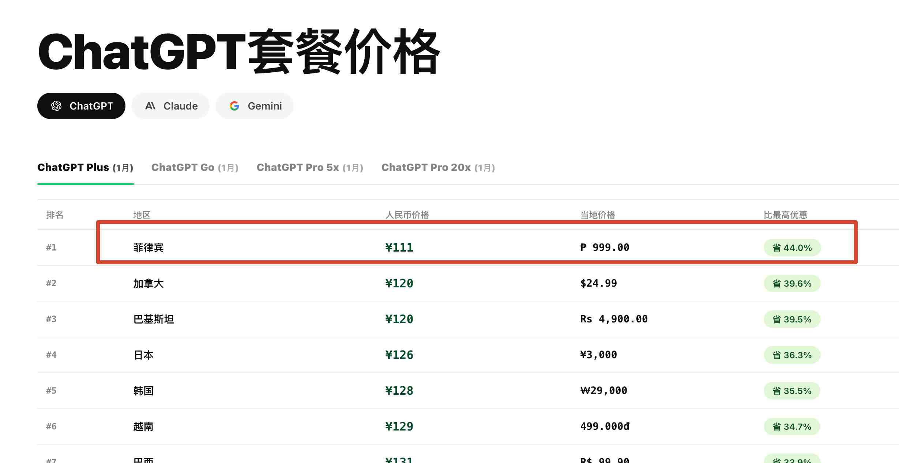
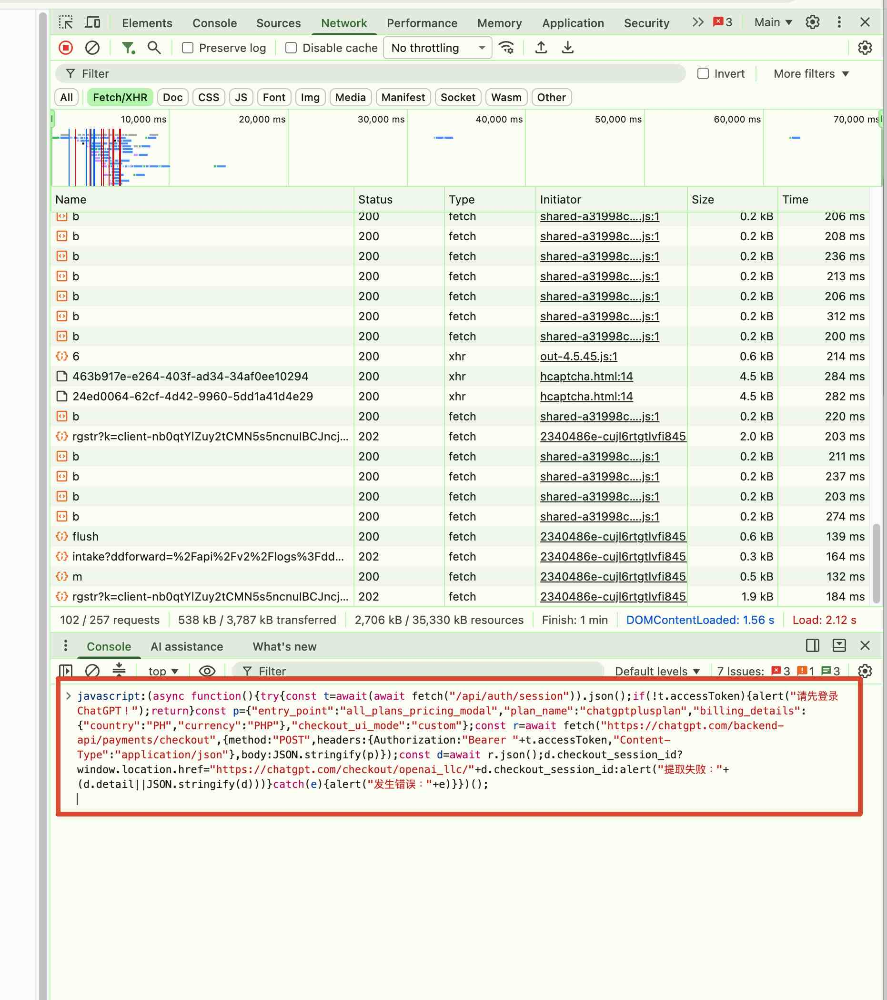
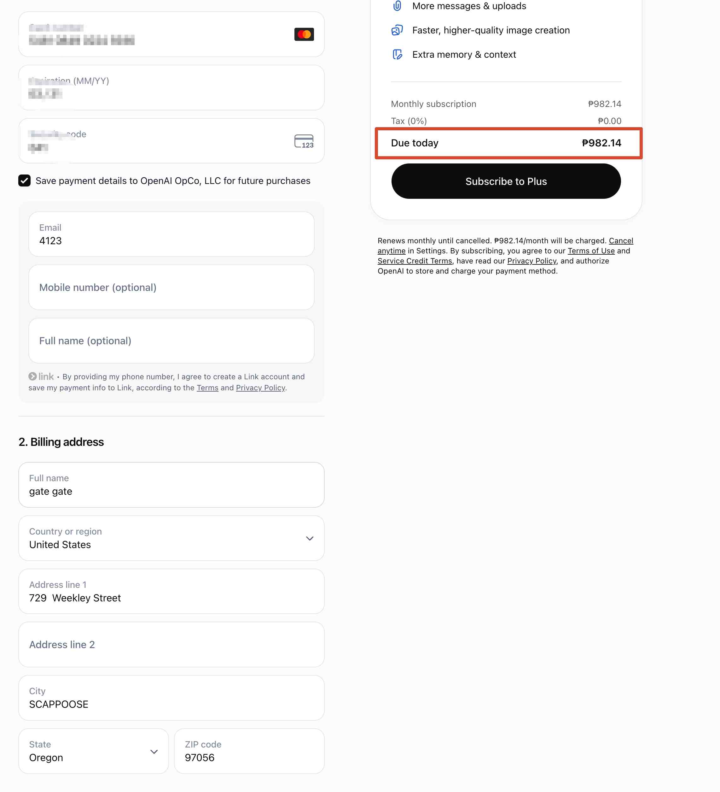
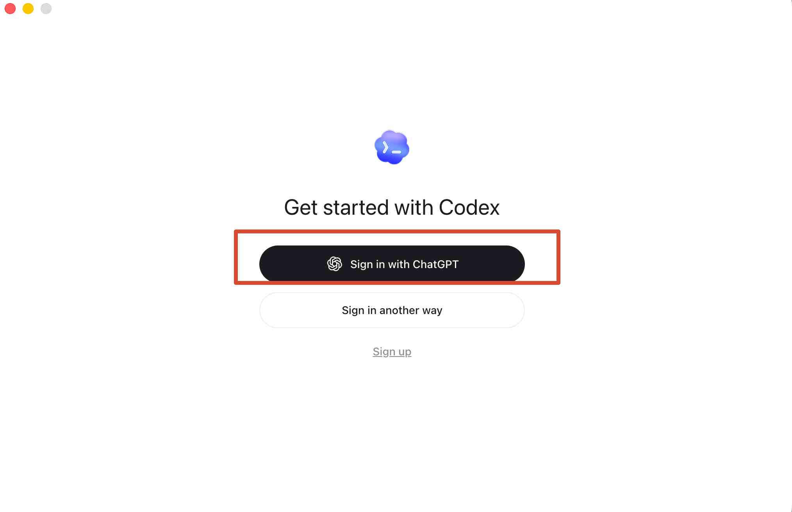
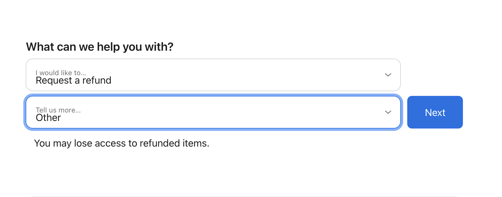

# 国内怎么便宜又方便的订阅GPT Claude 套餐

写这个是为了方便大家可以自己订阅GPT 或者Claude, 愿意自己用并且愿意自己的折腾的, 都可以用这个.
如果不愿意折腾, 就去 https://hvoy.ai 上找一个合适的中转站接入即可. 中转站选择可以看 https://github.com/zzsting88/relayAPI 这个 git.

## 如何订阅GPT

把GPT放在第一个, 是因为现阶段最推崇的就是GPT, 量多事少. 

具体GPT的价格可以看[这里](https://www.hvoy.ai/official-plans/chatgpt)

随着土区GPT涨价后, 现在最划算的应该是菲区.




### 如何选择套餐

如果用API不太多的人, 就用plus, 免税之后(后面会说) , 大概110人民币.
如果API用的很多的人, 就用Pro 20x, 免税之后大概1000人民币.

(2026-07-10 更新: 最近有些反馈不能直接订阅Pro 20X, 就可以选择先订阅 plus, 然后再升级成 Pro 20X. 总体花的钱是一样的)


### 准备工作
最主要准备的是两个.
1. 梯子, 能看到这个的, 大概率都已经有梯子了
2. 银行卡. 我确定可以用的包括  Fiat24(现在办不了新的了), Plasma , ether fi. 不确定的包括savo, n26. 确定不能用的包括 几乎所有的港卡, 国内的visa信用卡.   这里的很多卡都是u卡, 所以您要自己评估风险. 


### 如何操作
1. 用电脑 chrome 打开 https://chatgpt.com 
2. 最好注册一个新账号, 并且登录
3. 打开console, 在对话框里输入 
如果要订阅菲区的plus
```
javascript:(async function(){try{const t=await(await fetch("/api/auth/session")).json();if(!t.accessToken){alert("请先登录 ChatGPT！");return}const p={"entry_point":"all_plans_pricing_modal","plan_name":"chatgptplusplan","billing_details":{"country":"PH","currency":"PHP"},"checkout_ui_mode":"custom"};const r=await fetch("https://chatgpt.com/backend-api/payments/checkout",{method:"POST",headers:{Authorization:"Bearer "+t.accessToken,"Content-Type":"application/json"},body:JSON.stringify(p)});const d=await r.json();d.checkout_session_id?window.location.href="https://chatgpt.com/checkout/openai_llc/"+d.checkout_session_id:alert("提取失败："+(d.detail||JSON.stringify(d)))}catch(e){alert("发生错误："+e)}})();
```
譬如



如果要订阅菲区的pro 20x
```
javascript:(async function(){try{const t=await(await fetch("/api/auth/session")).json();if(!t.accessToken){alert("请先登录 ChatGPT！");return}const p={"entry_point":"all_plans_pricing_modal","plan_name":"chatgptpro","billing_details":{"country":"PH","currency":"PHP"},"checkout_ui_mode":"custom"};const r=await fetch("https://chatgpt.com/backend-api/payments/checkout",{method:"POST",headers:{Authorization:"Bearer "+t.accessToken,"Content-Type":"application/json"},body:JSON.stringify(p)});const d=await r.json();d.checkout_session_id?window.location.href="https://chatgpt.com/checkout/openai_llc/"+d.checkout_session_id:alert("提取失败："+(d.detail||JSON.stringify(d)))}catch(e){alert("发生错误："+e)}})();

```

4. 然后会进入到gpt的支付页面. 账单地址选择美国, 可以选一个免税州.  随便填一个免税州地址, 可以省掉12%的税. 可以选俄勒冈州  OR.   具体可以看这里. https://www.meiguodizhi.com/usa-address/oregon


一个plus  就只需要 983peso,约等于109人民币 


### 怎么GPT最大化使用
如果只需要使用网页, 那就用梯子, 使用网页即可.

但是, 不用codex的确太可惜, 下面说下两种使用的方法. 
第一步, 下载codex. 下载并安装 https://developers.openai.com/codex/app

#### 平时电脑都带着梯子
1. 打开codex, 选择用gpt登录

2. 去gpt里授权一下即可.

#### 平时不想带着梯子, 并且自己有境外服务器
这个就非常方便了. 你先用梯子登录codex. 

1. 把 https://help.router-for.me/cn/introduction/what-is-cliproxyapi.html 发给codex, 并且告诉codex你的服务器地址和登录方法, 让codex给你配置好CPA, 并且告诉生成好的apikey(记作APIKey1)
2. 挂着梯子,问codex, 怎么使用ccswitch, 让他帮你下载.
3. 问codex, 怎么把你的服务器地址, APIKey1 配置到ccswitch里.

结束.

### GPT 封号吗?
GPT 也封号. 封号的可能原因包括
1. 买了黑卡. 这个无解
2. 支付的他卡有问题, 所以不太建议找人代付.
3. 多个不同的 IP 登录.尤其是不小心用了大陆的 IP 登录 gpt 时, 很容易触发封号邮件. 


封号后, 如果是自己用银行卡订阅的, 基本上很难申述成功.
如果是Apple Store 订阅的, 给 Apple 发邮件即可. 


#### Apple 退款的方法
1. 浏览器里输入  https://reportaproblem.apple.com,
2. 输入你的密码
3. 选择 I’d like to那里选request a refund，
4. 原因选择"Others", 然后选择 "Next" 如下图.
5. 然后填原因.可以用下面的模板, 稍微改一下

```
I subscribed to ChatGPT XXX on 2026-07-10. Shortly after my subscription, my ChatGPT account was banned by OpenAl. I have not been able to use the Plus service at all since the ban. Since l paid for the service but cannot access it due to the account ban, I respectfully request a full refund for this subscription. Thank you.

```
Apple 一般会给退掉. 但是这个号就不能订阅 gpt 了, 只能买别的.


## 如何订阅Claude 

订阅 Claude Plan 就注定了要做好随时可能被封号的准备.

所以,在这种前提下,  非常不建议买便宜的号(700+ 或者 别的).

之前尼区的 Claude 很便宜, 但是最近价格也涨上去了.  现在Claude Pro 最便宜是巴基斯但, 120 人民币左右,  美国大概是 136. 在这种情况下, 价格相差不大, 美区的 Apple ID 里面的钱用途更多.

所以我会比较建议直接用美区的号.

所以, 目前(相对)比较靠谱的方案, 就是自己准备美卡, 或者买礼品卡, 从 Apple Store直接订阅 Claude Code.

万一被封号了, 钱还能退回到Apple Id里.

### Claude怎么减少封号的可能

Claude的核心是怎么减少封号的可能性.  说在前面的话:  **订阅 Claude Plan 就注定了要做好随时可能被封号的准备**

作为封了几个号的人, 可以说, 目前没有一个无敌的方法可以避免封号, 只能减少被封号的可能性

1. 用一个靠谱的邮箱.  大家普遍感觉 outlook, hotmail 这些邮箱没那么好, gmail 还可以, 其他国外常见的 zohomail, icloud 也还不错. *据说*, 如果是自己域名的邮件(譬如, 4123123.xyz 这种), 容易被封整个邮箱段.

2. 梯子. 这个很重要. 如果是哪个区的 claude, 就用那个区的 IP 做梯子.  最好是用 住宅 IP 做代理.  不过我自己一直用的是美国机房的CPA 反代, *感觉上*没有比住宅 IP 差太多. 选好这个 IP 之后, 就锁死, 不要飘来飘去. 

如果选了住宅 IP 做代理(或者没有反代的), 一定要看 IP 的质量
2.1 https://browserleaks.com/dns  看你的 ip 是不是都是美国的 DNS. 如果是自己的 IP, 一定需要这个
2.2 https://scamalytics.com/ip  看你的 IP 本身质量如何. 
2.3 https://ipinfo.io/what-is-my-ip 用这个看你的 IP 是不是住宅 IP

3. 改时区, 改语言. 把接入 claude 的机器的时区改成改成美国的时区, 改成英语语言. 

--待补充

